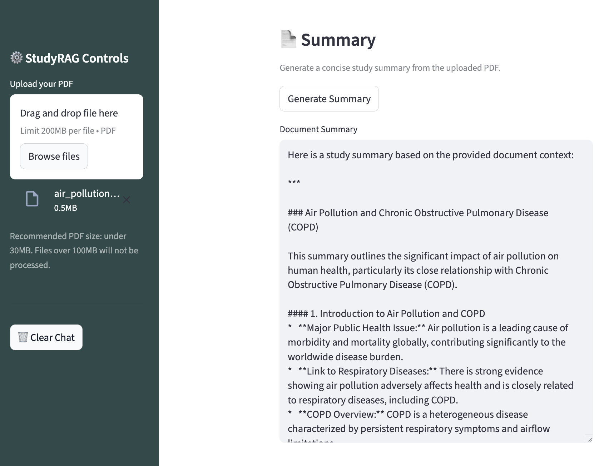
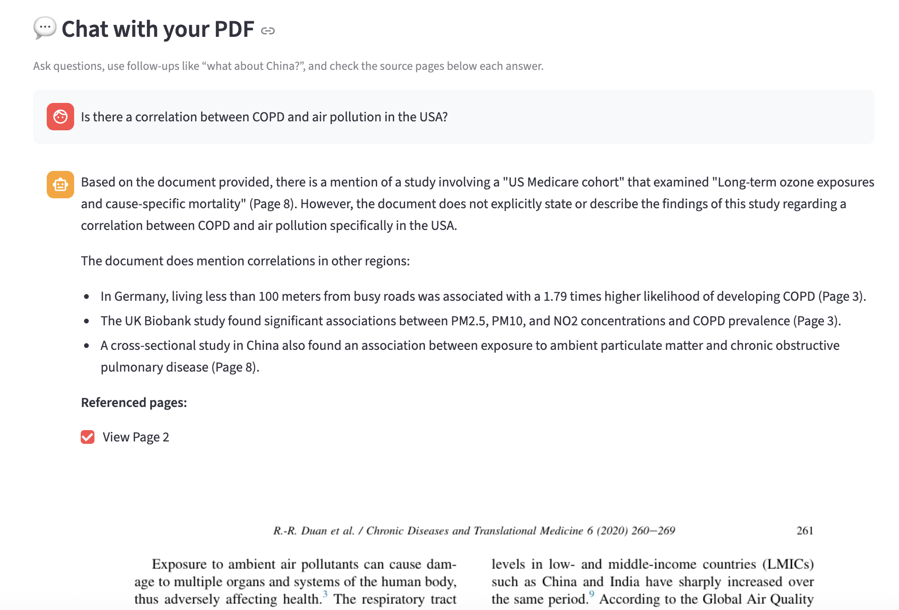
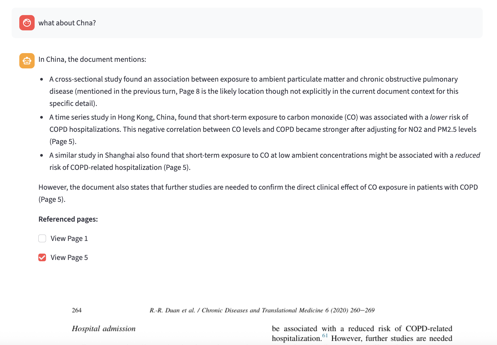
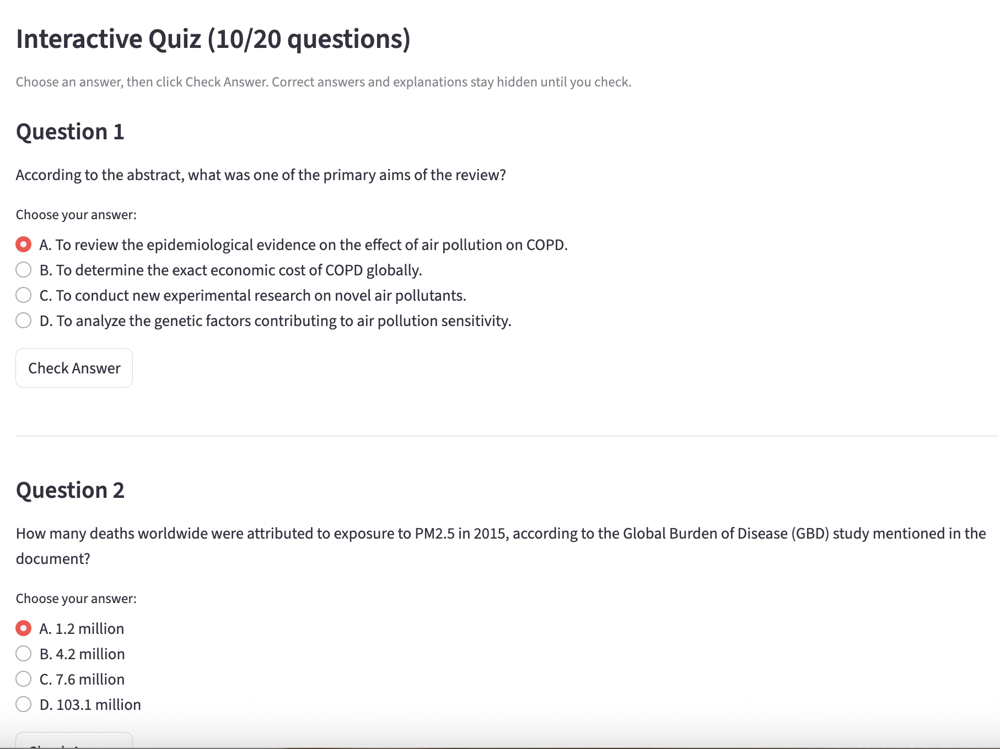
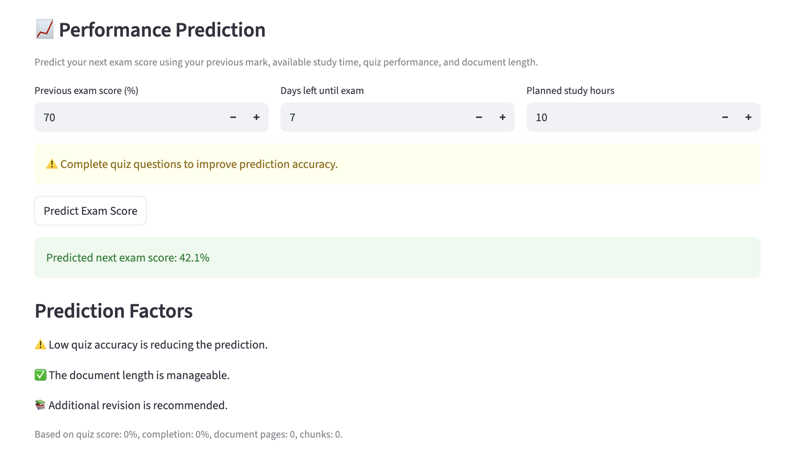

# 📚 StudyRAG AI

Final Year Project — An AI-powered Retrieval-Augmented Generation (RAG) study assistant for document-based learning, interactive quizzes, contextual chatbot support, and exam performance prediction.

---

## 🚀 Live Demo

🔗 https://studyragai.streamlit.app/

---

## 📖 Project Overview

StudyRAG AI is an intelligent study assistant designed to help students interact with academic materials more effectively using Retrieval-Augmented Generation (RAG).

The system allows users to upload PDF study materials and then:

- generate AI-powered summaries
- interact with documents using a contextual chatbot
- generate interactive multiple-choice quizzes
- preview referenced source pages directly from the document
- receive exam performance predictions based on quiz performance and study metrics

The application combines semantic retrieval, vector databases, embeddings, and large language models to provide grounded and context-aware educational assistance.

---

## ✨ Features

### 📄 PDF Processing
- Upload PDF study materials
- Extract and process document text
- Chunk text into semantic sections for retrieval

### 📚 AI Summary Generation
- Automatically generates structured study summaries
- Highlights key concepts and findings
- Produces concise revision material for students

### 🤖 Context-Aware RAG Chatbot
- Ask questions directly about uploaded PDFs
- Supports conversational follow-up questions
- Uses semantic retrieval for grounded answers
- Maintains conversational memory

### 🔎 Source-Grounded Responses
- Displays referenced source pages
- Allows users to preview PDF pages directly
- Improves transparency and explainability

### 📝 Interactive Quiz Generation
- Generates multiple-choice questions automatically
- Supports up to 20 quiz questions per document
- Includes explanations for answers
- Tracks quiz performance interactively

### 📈 Exam Performance Prediction
- Predicts future exam performance
- Uses:
  - previous exam score
  - study time
  - days remaining
  - quiz accuracy
  - quiz completion percentage
  - document complexity

### 🎨 Polished User Interface
- Custom Streamlit UI styling
- Responsive layout
- Dark-green themed sidebar
- Interactive document workflow

---

## 🧠 System Architecture

StudyRAG AI follows a Retrieval-Augmented Generation (RAG) pipeline:

```text
PDF Upload
   ↓
Text Extraction
   ↓
Text Chunking
   ↓
SentenceTransformer Embeddings
   ↓
ChromaDB Vector Storage
   ↓
Semantic Retrieval
   ↓
Gemini LLM Response Generation
   ↓
Context-Aware Answer + Source References
```

---

## 🛠️ Technologies Used

### Development Environment
- Visual Studio Code

### Frontend
- Streamlit

### AI / NLP
- Google Gemini API
- SentenceTransformers
- Retrieval-Augmented Generation (RAG)

### Vector Database
- ChromaDB

### Machine Learning
- Scikit-learn

### PDF Processing
- PyMuPDF
- PyPDF

### Deployment
- GitHub
- Streamlit Community Cloud

---

## 📂 Project Structure

```text
StudyRAG_AI/
│
├── app.py
├── requirements.txt
├── packages.txt
├── .gitignore
│
├── src/
│   ├── llm_utils.py
│   ├── rag_engine.py
│   ├── pdf_utils.py
│   ├── pdf_viewer.py
│   ├── predictor.py
│   ├── ui_components.py
│   └── model_comparison.py
```

---

## 📸 Screenshots

### Main Interface & Summary Generation



The application allows users to upload study PDFs and generate AI-powered summaries for efficient revision and concept understanding.

---

### Context-Aware RAG Chatbot



The chatbot answers questions using semantic retrieval from uploaded documents and provides grounded responses with referenced source pages.

---

### Conversational Follow-Up Questions



StudyRAG AI maintains conversational context, enabling users to ask follow-up questions naturally while preserving document grounding.

---

### Interactive Quiz System



The system automatically generates multiple-choice study questions with explanations and interactive answer validation.

---

### Performance Prediction Module



The prediction module estimates future exam performance using quiz accuracy, study time, document complexity, and completion metrics.

---

## ⚙️ Installation

Clone the repository:

```bash
git clone https://github.com/AsliOzdemirStrollo/StudyRAG_AI.git
```

Navigate into the project:

```bash
cd StudyRAG_AI
```

Create virtual environment:

```bash
python -m venv venv
```

Activate virtual environment:

### macOS/Linux

```bash
source venv/bin/activate
```

### Windows

```bash
venv\Scripts\activate
```

Install dependencies:

```bash
pip install -r requirements.txt
```

Run the application:

```bash
streamlit run app.py
```

---

## 🔐 Environment Variables

Create a `.env` file locally:

```env
GOOGLE_API_KEY=your_google_api_key
```

For deployment on Streamlit Cloud, add the secret inside:

```text
App Settings → Secrets
```

---

## ☁️ Deployment

The application is deployed using:

- GitHub
- Streamlit Community Cloud

Deployment workflow:

```text
Local Development
   ↓
Git Commit & Push
   ↓
GitHub Repository
   ↓
Automatic Streamlit Cloud Deployment
```

---

## 🧪 Post-Deployment Refinement

After deployment, several refinements and debugging improvements were performed, including:

- Streamlit state-management fixes
- Source-page rendering stabilization
- Sidebar UI refinements
- Prediction logic improvements
- Deployment troubleshooting
- Cloud environment debugging

---

## 🔮 Possible Future Improvements

- Multi-document semantic linking
- Highlighting exact referenced sentences
- OCR support for scanned PDFs
- Personalized study analytics
- Authentication and user accounts
- Exportable study notes
- Voice interaction support
- Advanced predictive analytics
- Cloud-scale vector database optimization

---

## 👩‍💻 Author

**Asli Özdemir Strollo**

Final Year Project — StudyRAG AI

---

## 📄 License

This project is intended for educational and portfolio purposes.
